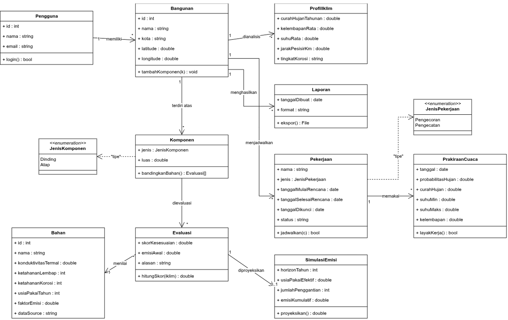

Wastu 

Wastu membantu pemilik rumah membandingkan pilihan bahan dinding dan atap berdasarkan kondisi iklim lokasi bangunan sekaligus jejak karbon tersemat tiap bahan, lalu menjadwalkan pekerjaan konstruksi sesuai prakiraan cuaca.

Manut 

Ketua Kelompok: <Dien Muhammad Scientivan Kurniapramono-24/533571/TK/59114>  
Anggota 1: Yohanes Anthony Saputra
Anggota 2: Ramzi Alfito Rizky

Class Diagram: 

