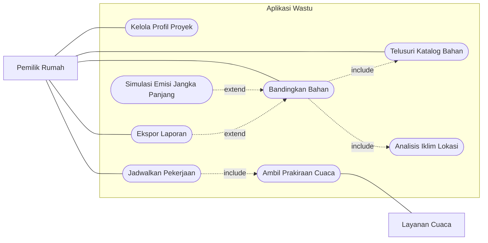
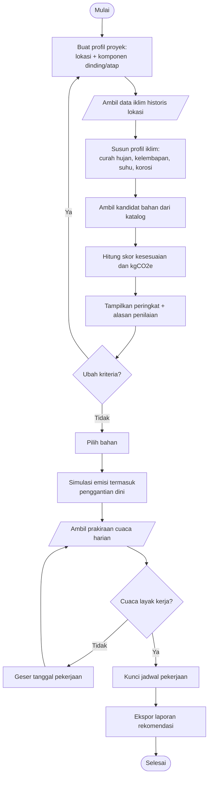
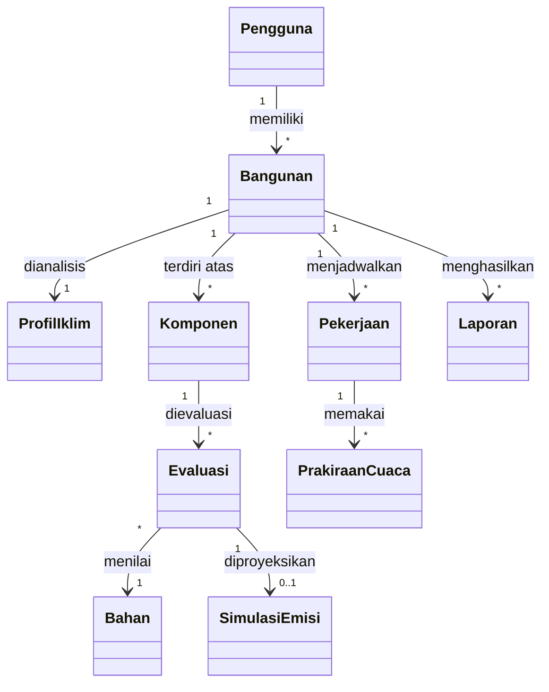
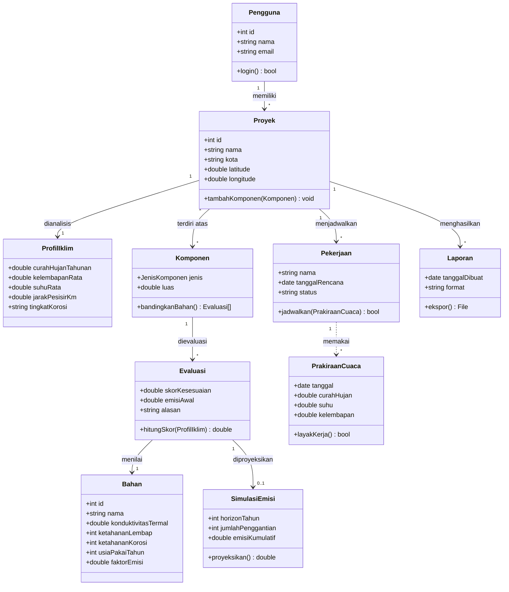

# Diagram UML — Wastu

Sumber diagram (Mermaid) untuk aplikasi **Wastu**: pemilihan bahan bangunan berbasis
kesesuaian iklim lokasi dan jejak karbon tersemat. Cakupan versi pertama: komponen
**dinding** dan **atap**.

---

## 1. Use Case Diagram

Aktor: pemilik rumah (pengguna utama) dan layanan cuaca pihak ketiga (aktor sistem).

---

## 2. Activity Diagram

Alur utama: dari pembuatan profil proyek sampai laporan rekomendasi siap dibawa ke kontraktor.

---

## 3. Domain Model

Entitas dan relasi inti, sebelum dilengkapi attribute dan method (lihat §4 untuk versi
lengkapnya). Dua kategori tipe (jenis komponen, jenis pekerjaan) sengaja tidak dimunculkan
di sini karena itu detail attribute, bukan entitas domain tersendiri.

---

## 4. Class Diagram

